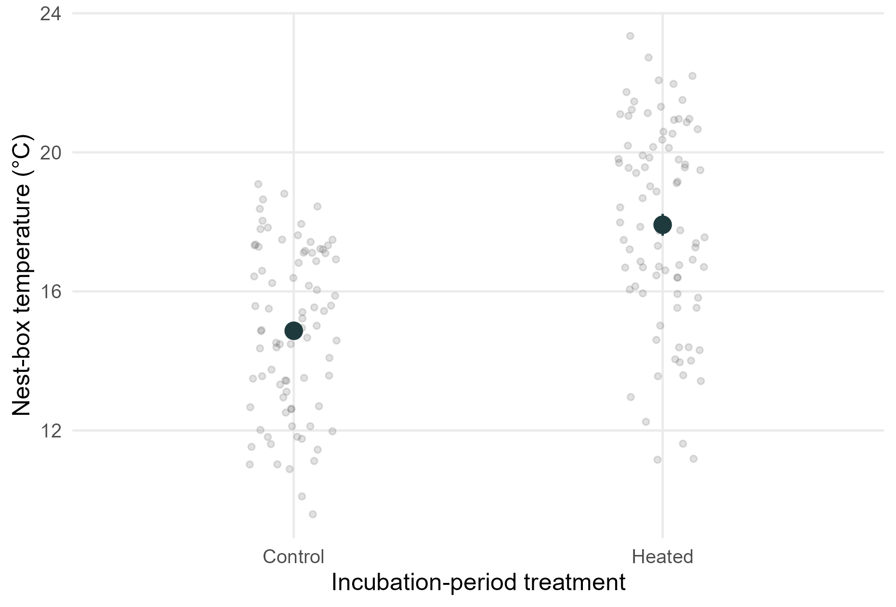

# Project overview

This website documents a reproducible analysis workflow for the nest-heating experiment in collared flycatchers (*Ficedula albicollis*) on Gotland.

```{r}
#| label: overview-hero-image
#| echo: false
#| out-width: "62%"
#| fig-align: "center"
#| fig-cap: "Conceptual overview of the collared flycatcher nest-heating experiment on Gotland, showing paired adults, nestlings, and contrasting thermal environments."

knitr::include_graphics("figures/overview/collared_flycatcher_nest_heating_overview.png")
```

This project tests how increased thermal conditions during breeding affect reproductive performance and offspring development in a wild population of collared flycatchers (*Ficedula albicollis*). We used a fully factorial 2 x 2 experimental design in which nest boxes were independently warmed during incubation and during the nestling period. Warming was applied from above by placing heat packs beneath the nest-box roof, thereby increasing nest temperature without placing a heat source directly inside the nest cup. This design created four treatment combinations and allowed us to test the separate and combined effects of elevated temperature before and after hatching.

We analyse reproductive performance as hatchability, defined as the probability that eggs hatch, and post-hatching survival, defined here as survival to day 12. In addition, we examine offspring development by analysing nestling growth rate, body size, and body mass. These traits allow us to test whether thermal conditions affect not only hatching and survival, but also the developmental trajectory and condition of surviving young.

The analyses address two related questions. First, we test whether experimental warming during incubation, experimental warming during the nestling period, and their interaction affect reproductive performance and offspring development. Second, we examine whether naturally experienced ambient temperatures during incubation and during the nestling period, together with their interaction, are associated with the same reproductive and developmental responses. Thus, the experimental analyses test causal effects of increased nest temperature, whereas the temperature-based analyses ask whether variation in ambient thermal conditions across breeding stages predicts similar biological outcomes.

## Study system

The study was conducted on collared flycatchers (*Ficedula albicollis*) breeding in nest boxes on Gotland. The dataset currently covers four breeding seasons, 2022-2025. The experiment manipulated the thermal environment of nest boxes during incubation and/or the nestling period, allowing comparison of heated and control nests.

## Experimental design

The experiment includes two treatment variables:

| Variable | Description | Levels |
| --- | --- | --- |
| `EXP.INC` | Incubation-stage nest-box warming treatment. Indicates whether the nest box was experimentally warmed during incubation or remained unheated as a control. | `Control` / `Heated` |
| `EXP.NEST` | Nestling-stage nest-box warming treatment. Indicates whether the nest box was experimentally warmed during the nestling period or remained unheated as a control. | `Control` / `Heated` |

The combined treatment group is stored as `GROUP`, with four combinations: `CONCON`, `CONEXP`, `EXPCON`, and `EXPEXP`.

```{r}
#| label: overview-experimental-design
#| echo: false
#| out-width: "72%"
#| fig-align: "center"
#| fig-cap: "Experimental design of the stage-specific nest warming experiment."

knitr::include_graphics("figures/overview/experimental_design.png")
```

## Temperature manipulation check

To verify that the experimental treatment changed the thermal environment inside nest boxes, we tested whether nest-box temperature differed between incubation-period control and heated nests while controlling for year:

```text
TEMP.BOX ~ EXP.INC + YEAR
```

The analysis used brood-level records from `CF_exp.broods_analysis`. In the current workbook, heated nest boxes were on average 2.9 °C warmer than control nest boxes. Mean ± SE nest-box temperature was 17.9 ± 0.3 °C for heated nests and 14.9 ± 0.3 °C for control nests.

```{r}
#| label: overview-manipulation-check-results
#| echo: false
#| message: false
#| warning: false

library(readr)
library(dplyr)
library(knitr)

temperature_tests <- read_csv("models/manipulation_check/nestbox_temperature_tests.csv", show_col_types = FALSE) |>
  mutate(
    F_value = round(F_value, 2),
    p_value = if_else(p_value < 0.001, "<0.001", formatC(p_value, digits = 3, format = "f"))
  )

kable(
  temperature_tests,
  col.names = c("Effect", "df", "Sum of squares", "F", "p")
)
```

```{r}
#| label: overview-manipulation-check-figure
#| echo: false
#| out-width: "58%"
#| fig-align: "center"
#| fig-cap: "Nest-box temperature in incubation-period control and heated nests. Pale points show brood-level observations; dark points and vertical intervals show mean ± SE."


```

## Files needed to reproduce the analyses

The original database is kept in the repository as [`CF_exp_all_2026.xlsx`](CF_exp_all_2026.xlsx). The analyses shown on this website use the prepared nestling-level analysis dataset [`data/prepared_nestlings.rds`](data/prepared_nestlings.rds), with a CSV copy available as [`data/prepared_nestlings.csv`](data/prepared_nestlings.csv). The prepared file was created from the original database after filtering sexed nestlings, removing later broods from repeated females, deriving response variables, and retaining only columns used in the analyses.

## Computational environment

The website and analysis outputs are generated in R. The code below records the R version used when this page is rendered.

```{r}
#| label: overview-r-version
#| echo: true
#| message: false
#| warning: false

R.version.string
R.version$platform
```
