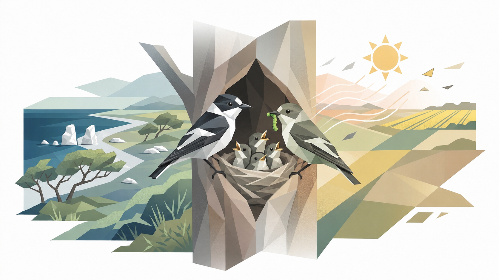
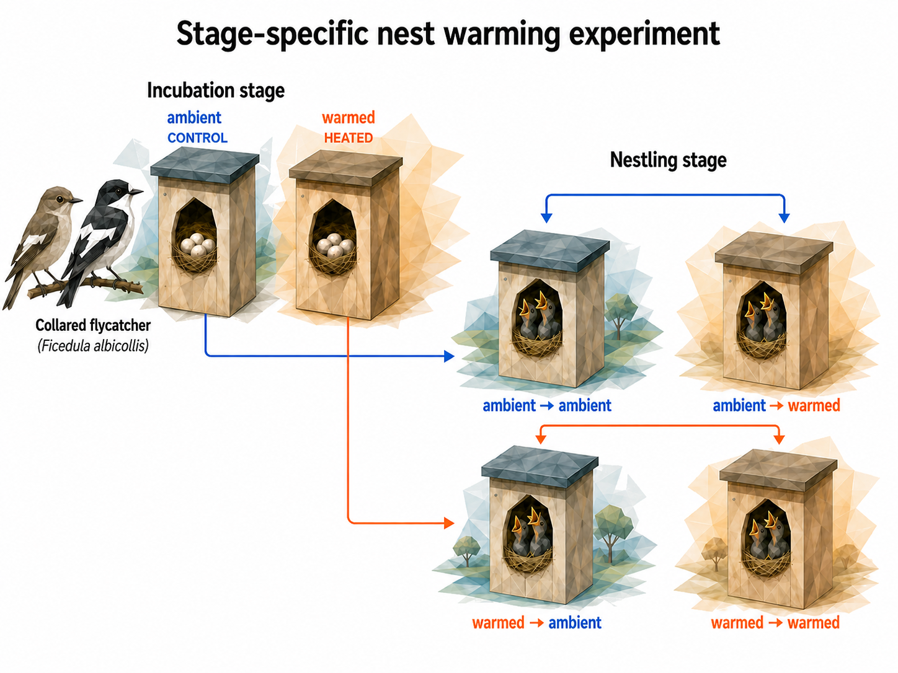

# Project overview

This website documents a reproducible analysis workflow for the nest-heating experiment in collared flycatchers (*Ficedula albicollis*) on Gotland.

```{r}
#| label: overview-hero-image
#| echo: false
#| out-width: "62%"
#| fig-align: "center"
#| fig-cap: "Conceptual overview of the collared flycatcher nest-heating experiment on Gotland, showing paired adults, nestlings, and contrasting thermal environments."


```

This project tests how experimentally increased nest temperature affects reproductive performance and offspring development in a wild population of collared flycatchers (*Ficedula albicollis*). Using a fully factorial 2 × 2 design, we independently warmed nest boxes during incubation and during the nestling period. Warming was applied from above by placing heat packs beneath the nest-box roof, thereby increasing nest temperature without placing a heat source directly inside the nest cup. This design created four treatment combinations and allowed us to separate thermal effects acting before hatching from those acting after hatching.

We analyse reproductive performance at two key stages: hatchability, defined as the probability that eggs hatch, and post-hatching survival, defined as the probability that hatched young survive to fledging. In addition, we examine offspring development by analysing nestling growth rate, body size, and body mass. These traits allow us to test whether thermal conditions affect not only survival, but also the developmental trajectory and condition of surviving young.

The analyses separate two related questions. The primary results test whether the experimental thermal treatments affect offspring traits and survival. Additional model pages test whether incubation-stage and nestling-stage warming interact, and whether measured nest temperatures during incubation and the nestling period are associated with the same responses.

## Study system

The study was conducted on collared flycatchers (*Ficedula albicollis*) breeding in nest boxes on Gotland. The dataset currently covers four breeding seasons, 2022-2025. The experiment manipulated the thermal environment of nest boxes during incubation and/or the nestling period, allowing comparison of heated and control nests.

## Experimental design

The experiment includes two treatment variables:

- `EXP.INC`: incubation-period treatment, coded as heated or control.
- `EXP.NEST`: nestling-period treatment, coded as heated or control.

The combined treatment group is stored as `GROUP`, with four combinations: `CONCON`, `CONEXP`, `EXPCON`, and `EXPEXP`. Nests were paired into blocks according to clutch/egg number and hatching date, and this paired structure is represented by `BLOCK` in the source dataset.

```{r}
#| label: overview-experimental-design
#| echo: false
#| out-width: "72%"
#| fig-align: "center"
#| fig-cap: "Experimental design of the stage-specific nest warming experiment."


```

## Workflow

The website documents the full analytical workflow, from data preparation and treatment coding to response-variable construction, model fitting, diagnostics, sensitivity analyses, prediction plots, and biological interpretation.

The workflow is organised around five steps:

- data import from the raw workbook,
- creation of the analysis dataset after removing later broods from repeated females,
- fitting primary experiment models with `glmmTMB`,
- fitting separate interaction models for experimental treatments and measured external temperature,
- generating model summaries, diagnostics, and publication figures.

## Files needed to reproduce the analyses

The original database is kept in the repository as [`CF_exp_all_2026.xlsx`](CF_exp_all_2026.xlsx). The analyses shown on this website use the prepared nestling-level analysis dataset [`data/prepared_nestlings.rds`](data/prepared_nestlings.rds), with a CSV copy available as [`data/prepared_nestlings.csv`](data/prepared_nestlings.csv). The prepared file was created from the original database after filtering sexed nestlings, removing later broods from repeated females, deriving response variables, and retaining only columns used in the analyses.

## Computational environment

The website and analysis outputs are generated in R. The code below records the R version used when this page is rendered.

```{r}
#| label: overview-r-version
#| echo: true
#| message: false
#| warning: false

R.version.string
R.version$platform
```
